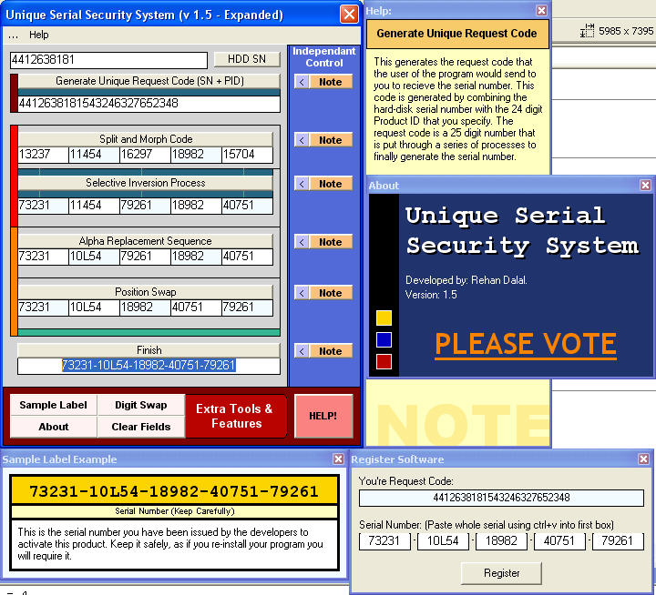



## Unique Serial Number Protection \*\*UPDATED AGAIN \- Version 1\.5\*\*

### Description

This is an example of a method for developing a serial based registration/activation for your software. It develops a 25 digit using the hard disk serial number of the user, and a ProductID which you supply. The user is provided with a request code, which is sent to you, and you send back the serial based on the request code. I've found it to work pretty well. Though I would share it with everyone else. There is negligible commenting in the code, however use the note and help utility to see how the code works, and how each process takes place. Easy to manipulate to meet your need. Hope it's of some use to someone...

**UPDATED - Version 1.2**

Added new features such as digit swapping and label previews. Also changed certain routines.

**UPDATED AGAIN - Version 1.5**

Added sample registration form. Good example of how to allow users to paste the whole key into one textbox, and have the program split it to fill up all 5 appropriately...
 
### More Info
 

             |
---                |---
**Submitted On**   |2004-05-30 02:55:28
**By**             |[Rehan R\. Dalal](https://github.com/Planet-Source-Code/PSCIndex/blob/master/ByAuthor/rehan-r-dalal.md)
**Level**          |Beginner
**User Rating**    |4.7 (113 globes from 24 users)
**Compatibility**  |VB 4\.0 \(32\-bit\), VB 5\.0, VB 6\.0
**Category**       |[String Manipulation](https://github.com/Planet-Source-Code/PSCIndex/blob/master/ByCategory/string-manipulation__1-5.md)
**World**          |[Visual Basic](https://github.com/Planet-Source-Code/PSCIndex/blob/master/ByWorld/visual-basic.md)
**Archive File**   |[Unique\_Ser1751645302004\.zip](https://github.com/Planet-Source-Code/rehan-r-dalal-unique-serial-number-protection-updated-again-version-1-5__1-54088/archive/master.zip)

